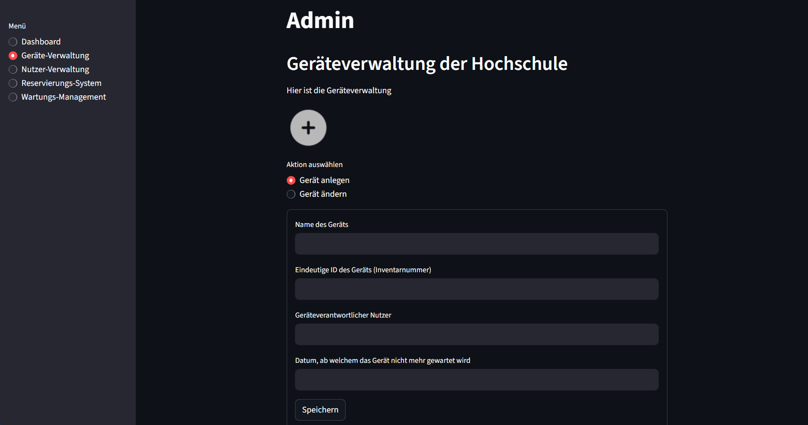
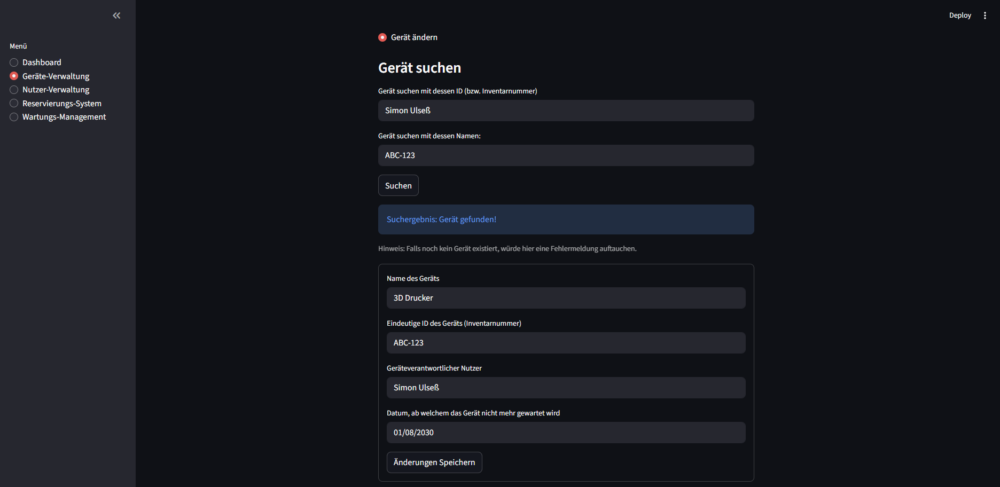
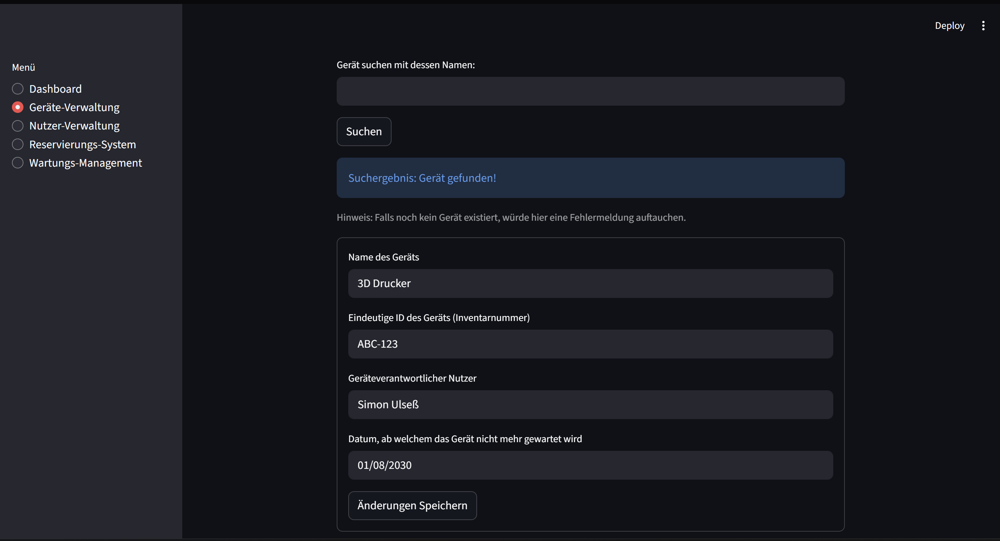

# Case Study 1 Geräteverwaltung an einer Hochschule 
## Abgabe 1: Mockup für die Geräteverwaltung 
Das Repository enthält die erste Abgabe der Case-Study-1, speziell die Datei mockup-ui.py.
Alle anderen Dateien wurden aus den Vorlesungsunterlagen ebenfalls schon hinzugefügt und werden im weiteren Verlauf bearbeitet und angepasst.

## Screenshots des Mockup-UI 

